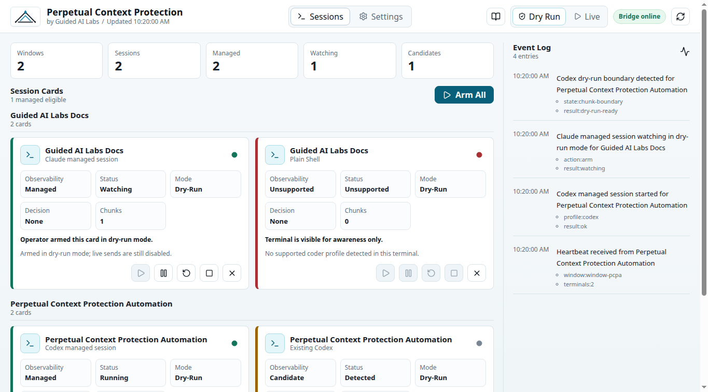
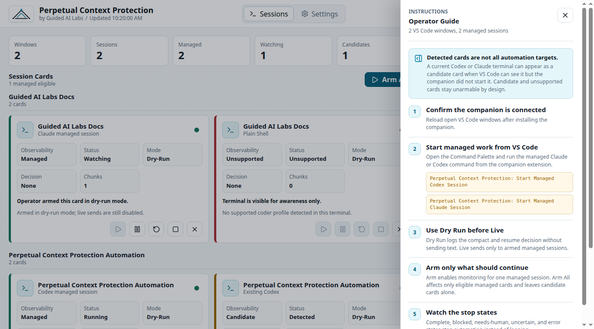
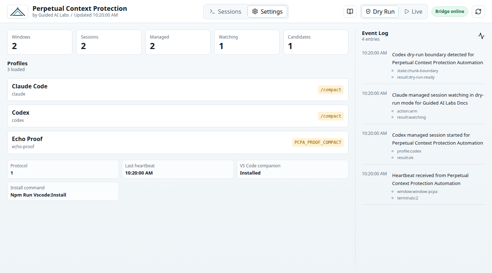

# Perpetual Context Protection Automation

by Guided AI Labs

Last updated: 2026-06-30T10:26:43-06:00

GitHub repository:
<https://github.com/Adamgdwn/perpetual-context-protection-automation>

## Purpose

Perpetual Context Protection Automation is a desktop operator app and VS Code
companion extension for protecting long AI-coding sessions from context-window
drift.

The operator opens the desktop app before stepping away, sees cards for detected
VS Code windows and coder sessions, chooses which sessions to arm, and lets the
tool compact and resume Claude, Codex, or later coder CLIs at safe chunk
boundaries.

The product goal is coder agnostic: observe when a session is paused at a useful
boundary, send the configured compact command, wait for compaction to finish,
send the configured resume instruction, and stop cleanly when the task is
complete or blocked.

## 2026-06-30 - Current Preview

The current desktop shell has a light Guided AI Labs visual treatment, a
Signal Spark header mark, session cards, bridge health, an event log, an
operator guide, and a settings/profile view.

The screenshots below use representative local bridge data so the GitHub page
shows the intended operator experience even when no live VS Code sessions are
connected.







## 2026-06-30 - What Works So Far

- Electron desktop app with branded header, session metrics, grouped session
  cards, event log, settings/profile pane, and operator guide.
- Localhost bridge that receives VS Code heartbeats, starts managed PTY
  sessions, exposes desktop state, and accepts guarded operator actions.
- VS Code companion extension commands for heartbeat, managed Codex launch,
  managed Claude launch, I/O proof, and sending text to managed sessions.
- Dry Run and Live automation modes. Dry Run records compact/resume decisions
  without sending text; Live sends only to armed managed sessions.
- Candidate and unsupported sessions remain visible for awareness but cannot be
  armed for unattended automation.
- Linux launcher and VS Code extension install scripts are in place.
- Unit, lint, build, desktop smoke, and VS Code extension-host checks exist for
  the current workflow.

## Status

- Owner: Adam Goodwin
- Technical lead: hybrid session (Claude Code + Codex)
- Governance level: 1
- Risk tier: low
- Production status: branded local desktop/operator proof complete - Windows packaging pending
- Public repo: `Adamgdwn/perpetual-context-protection-automation`

## Quick Start

Use the existing nvm Node install, then install dependencies and run checks.

```bash
source /home/adamgoodwin/.nvm/nvm.sh
nvm use --silent
npm install
npm run lint
npm test
npm run build
npm run desktop:smoke
npm run test:vscode
npm run vscode:package
```

## 2026-06-30 - Use The Current Build

Build the desktop app and companion extension:

```bash
source /home/adamgoodwin/.nvm/nvm.sh
nvm use --silent
npm install
npm run build
npm run vscode:install
```

Launch the desktop shell:

```bash
npm run desktop:launch
```

Install or refresh the Linux desktop launcher:

```bash
npm run desktop:install-linux-launcher
```

On this workstation the launcher is installed at:

```text
/home/adamgoodwin/Desktop/Perpetual Context Protection.desktop
```

Open VS Code, then use the Command Palette to start managed sessions:

```text
Perpetual Context Protection: Start Managed Codex Session
Perpetual Context Protection: Start Managed Claude Session
```

Recommended operator flow:

1. Launch the desktop app before stepping away.
2. Confirm the bridge is online and VS Code windows are visible.
3. Start Codex or Claude through the companion extension so the card is
   `Managed`.
4. Keep automation in `Dry Run` for the first observed cycle.
5. Arm one managed card, or use `Arm All` for eligible managed cards.
6. Review the event log after dry-run decisions.
7. Switch to `Live` only when you are ready for the app to send compact/resume
   text to armed managed sessions.
8. Use Pause, Reset, Kill, and Dismiss per card when a session needs individual
   attention.

## 2026-06-30 - Current Limits

- This is still a local proof, not a release-ready packaged product.
- Windows packaging and cross-machine release validation are still pending.
- Unattended automation is intentionally limited to bridge-managed sessions.
- Existing terminals detected as `Candidate` or `Unsupported` should be
  relaunched through the VS Code companion before unattended use.
- The desktop header and color system use Guided AI Labs branding; the product
  name, VS Code command names, and current launcher icon remain Perpetual
  Context Protection until intentionally changed.

## 2026-06-30 - Validation

Recent validation for the branded desktop pass:

```bash
npm run compile
npm run lint
npm run build
npm run desktop:smoke
npm test
```

Use `docs/current-build-pathway.md` as the active implementation route. The
original tmux/n8n research plan in `PLAN.md` is retained as superseded research,
not the current build path.

The current implementation includes the VS Code companion extension, localhost
bridge, managed PTY session path, and Electron desktop shell. The desktop app
renders bridge-backed workspace-grouped session cards, append-only logs,
dry-run/live automation mode, and guarded operator actions where candidate and
unsupported sessions remain visible but cannot be armed unattended.

If the desktop app ever opens blank, run `npm run desktop:smoke`; the smoke
check fails unless the rendered app shell text appears.

## Key Files

- `docs/current-build-pathway.md` - active token-friendly chunk plan
- `docs/specs/2026-06-29-vscode-first-build-plan.md` - product and architecture plan
- `docs/architecture.md` - current system architecture
- `docs/roadmap.md` - milestone timeline
- `PLAN.md` - superseded tmux/n8n research plan retained for reference

## Documentation

- `docs/architecture.md`
- `docs/context-map.md`
- `docs/current-build-pathway.md`
- `docs/manual.md`
- `docs/roadmap.md`
- `docs/policy/durable-development-engineering-policy.md`
- `docs/standards/README.md`
- `docs/standards/engineering-governance-by-use-case.md`
- `docs/standards/ship-ready-engineering-standard.md`
- `docs/standards/context-hygiene-standard.md`
- `docs/deployment-guide.md`
- `docs/runbook.md`
- `docs/CHANGELOG.md`
- `docs/risks/risk-register.md`

## Support Model

Maintained by Adam Goodwin. Operational issues handled via Claude Code or Codex sessions using the standard agentic workflow.
